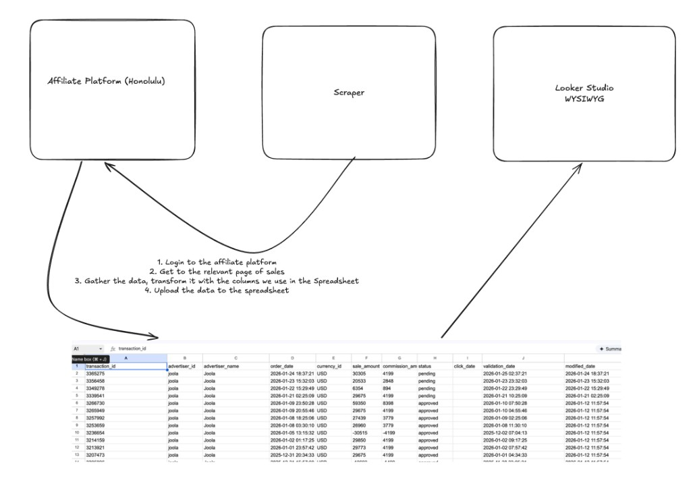

# kitchen-scripts

This repository holds **automated helpers** that collect affiliate commission information from partner websites and put it into **one shared Google spreadsheet**. That spreadsheet is the source for reporting (for example in **Looker Studio**), so finance and ops can see sales and commissions in one place instead of logging into many different affiliate tools by hand.

**Live commissions sheet:** [open the spreadsheet](https://docs.google.com/spreadsheets/d/1DWtmjS3575qsrOhEkv7IpjNp9YDtKEcleFpofKy9N4E/edit?gid=1647693706#gid=1647693706)

---

## How the process works (big picture)

Each brand may use a different **affiliate platform** (the site where commissions are tracked). A small program—a **scraper**—runs on a schedule and does the repetitive work:

1. **Sign in** to the affiliate platform with stored credentials (the same kind of login a person would use).
2. **Open the right screens** where payouts or sales are listed.
3. **Copy the numbers and details**, then **line them up** with the columns we use in the spreadsheet (things like order date, amounts, status, and IDs), so every row looks consistent.
4. **Send those rows** into the Google Sheet so they stay up to date.

The **spreadsheet** is the single place we trust for “what happened across programs.” **Looker Studio** (or similar tools) can connect to that sheet to build charts and dashboards—no code required there; it’s a visual report builder.

---

## What runs automatically

The scrapers do **not** need someone to sit at a computer. In production they run in **GitHub Actions** (cloud automation tied to this code repository):

- They run **several times per day** so the sheet stays reasonably fresh during business hours across US time zones.
- Someone can also **start a run manually** from the repo’s **Actions** tab if needed.

If you maintain this repo: see [`.github/README.md`](.github/README.md) for required secrets (passwords and API keys stored safely in GitHub), and [`.github/workflows/scrape-and-upload.yml`](.github/workflows/scrape-and-upload.yml) for the exact schedule and steps.

---

## For developers

This is a **pnpm monorepo**: install once at the repo root (`pnpm install`). Each affiliate stack lives under [`packages/`](packages/) (for example BixGrow, SocialSnowball, Shortly, UpPromote, Affiliatly, GoAffPro). Root scripts in [`package.json`](package.json) call those packages (`pnpm bixgrow`, `pnpm uppromote:all`, etc.).

Scrapers typically use a headless browser (**Puppeteer**) and sometimes direct APIs after login. Rows are normalized to match the sheet schema; uploads use a Google **service account** (`credentials.json` locally, `GOOGLE_CREDENTIALS_JSON` in CI; `GOOGLE_SHEET_ID` selects the destination file).

For flags, environment variables, and `.env` layout for a specific integration, read the README inside that package folder.
